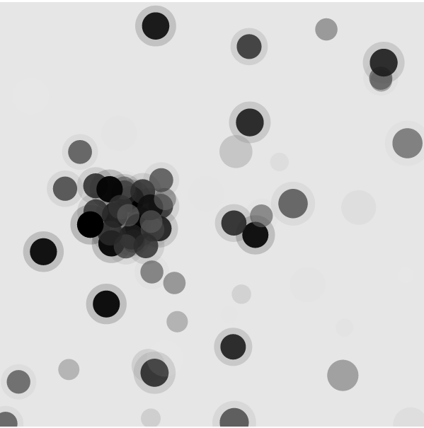
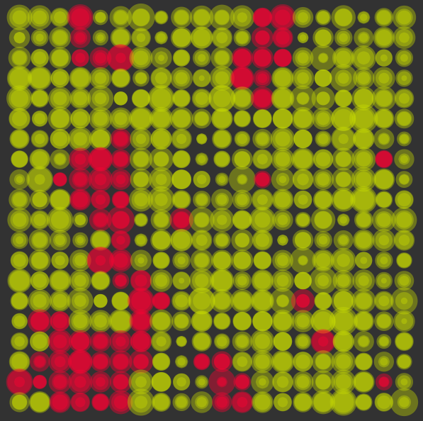
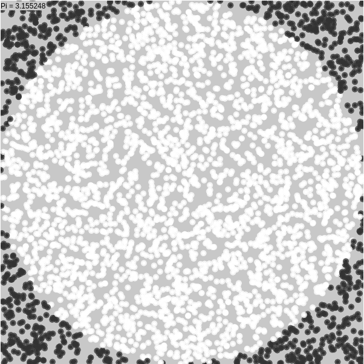
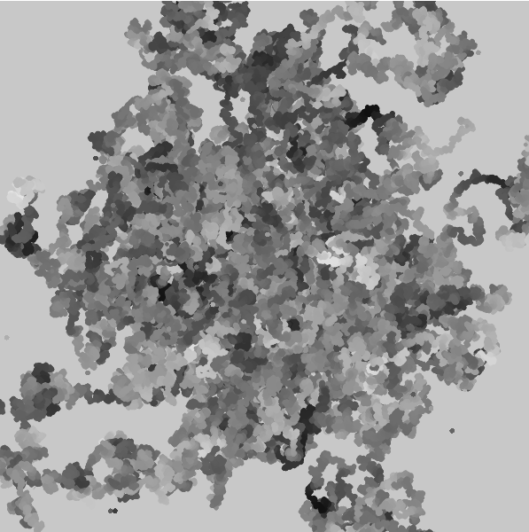

Scientific simulations in C
===========================

A bunch of scientific simulations with respective visualizations done in C and
visualized in Javascript with [p5.js](http://hello.p5js.org/).

Each folder's README file contains instructions on how to compile and visualize 
each system. Send any comments to agg.unam@ciencias.unam.mx .

The simulated systems are the following:

Ising model in 1D
-----------------

A montecarlo simulation of the coupling of atomic spins along a line.

Ising model in 2D
-----------------

A montecarlo simulation of the coupling of atomic spins of atoms in a plane.

Montecarlo calculation of pi
----------------------------

Use geometry and probability to calculate the famous circle number.

Random walker
-------------

A cloud of random walkers in the plane.

Molecular dynamics simulation of a Lennard-Jones liquid
-------------------------------------------------------

Simulation of a system of particles that interact with the Lennard-Jones 
potential, implemented using molecular dynamics with a velocity vertlet 
integrator algorithm.

