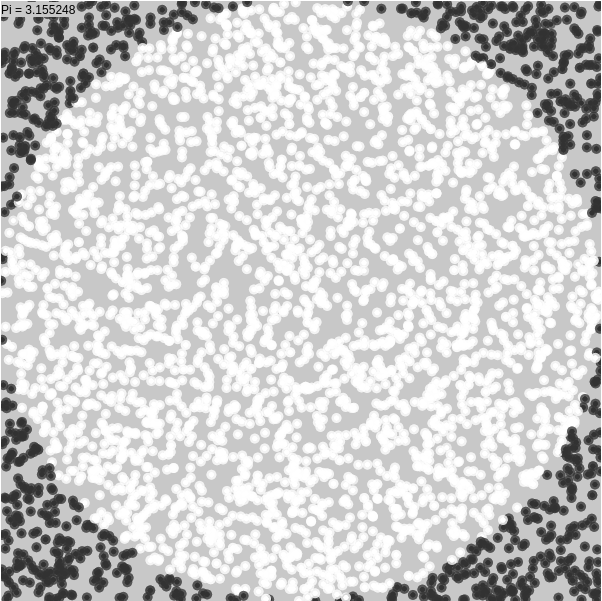

Pi calculation
--------------

Calculation of Pi using a Monte Carlo method visualized in the browser.

Usage
=====

NOTE: This is for UNIX machines.

**TL;DR**: Just enter in a terminal `cc pi.c -lm -o pi; ./pi 100000 | ./server.py` and open the file `index.html` in a browser.

To see the simulation, first compile the c code:

        cc pi.c -lm -o pi
        
Then, simulate, and save the output with:

        ./pi N_PARTICLES > simulation.dat
        
The output must be served via web with:

        python3 ./server.py < simulation.dat
        
Finally, open the `index.html` file in a browser.
        
 
